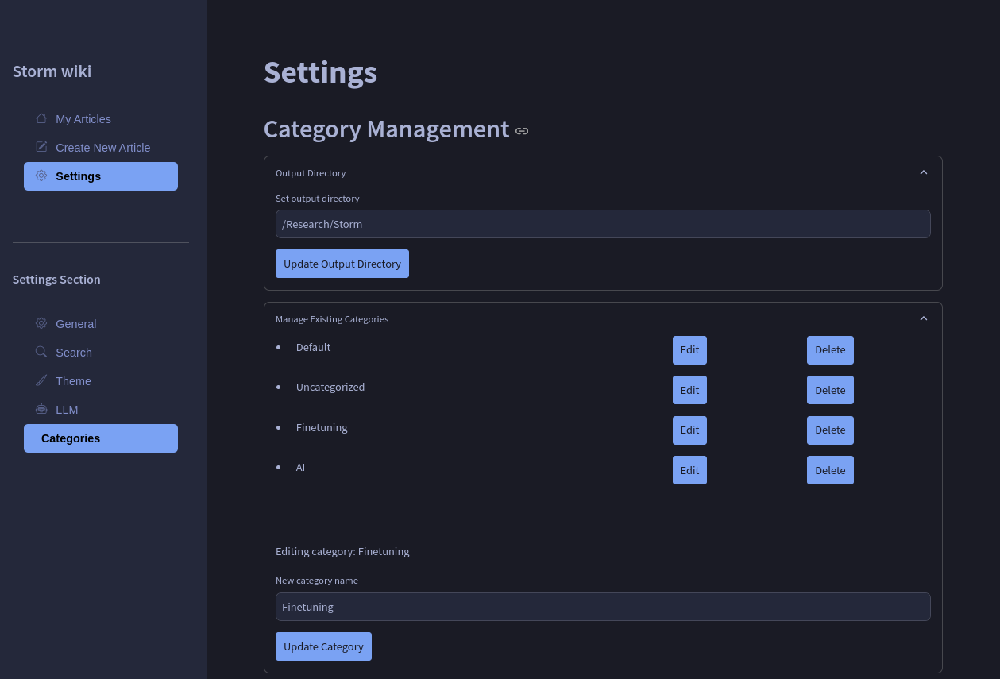
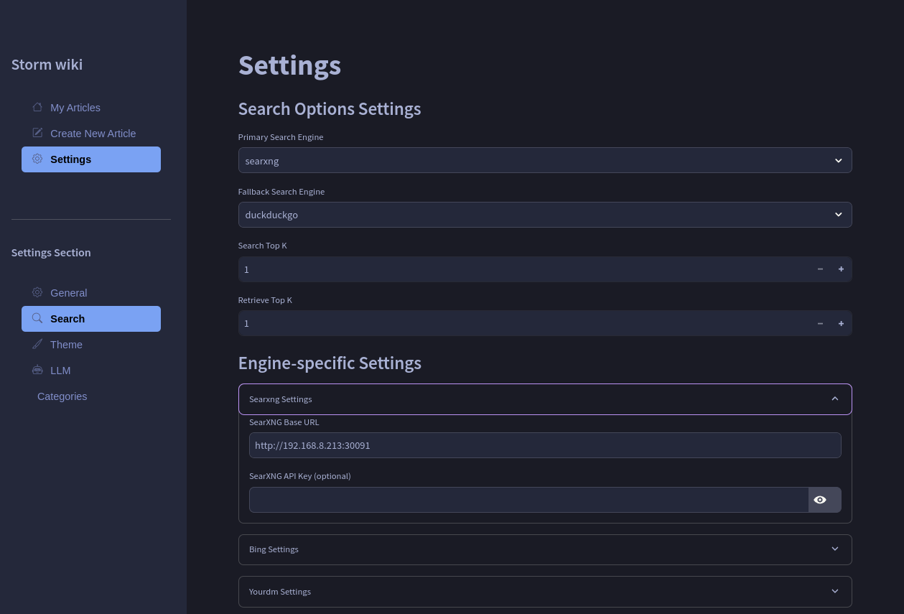

# STORM wiki

[STORM](https://github.com/stanford-oval/storm) frontend modified.

## Features & Changes

- dotenv for env vars
- save result files as '*.md'
- add date to to top of the result file
- added STORM_TIMEZONE
- configure dark and light theme colors
- configure arize-phoenix in settings
- configure searxng and other search engines in settings


<details><summary>screenshots</summary>

article


creating new article with search and llm fallback options


add categories



configure search engines



dark and light themes


</details>

## Prerequisites

- Python 3.10+
- `knowledge-storm` package or source code
- Required API keys (see main STORM repository)

## Installation

1. Clone and install dependencies
   ```sh
   git clone https://github.com/jaigouk/storm_wiki.git
   cd storm_wiki

   cp .env.example .env
   cp secrets.toml.example ./.streamlit/secrets.toml

   # update .env and secrets.toml with vscode or any other editor

   pip install -r requirements.txt
   streamlit run storm.py --server.port 8501 --server.address 0.0.0.0
   ```

3. Configure search engines
   1. visit settings menu and click Search settings
   2. add necessary values. as of now Bing and You search is not usable. but you can use searxng, arxiv, duckduckgo
   3. choose primary and fallback search engines. Sometimes, duckduckgo or searxng may not return the results because of rate limit.

4. Configure LLM
   1. visit LLM menu and choose primary and fallback LLM
   2. for ollama, you will be able to see localhost llm list. choose them with max tokens.
   3. ollama can also fail with various reasons. for that you can choose fallback llm like openai's gpt-4o-mini

5. Categories setting
   1. You can choose output directory. this is the root directory that category folders will be created
   2. You can edit and delete existing categories. When deleting a category, it will ask which folder to use to move existing articles.
   3. You can create a new category folder.

## Usage

Run the Streamlit app:
```sh
streamlit run storm.py --server.port 8501 --server.address 0.0.0.0

```

## migrating existing articles with category
```sh
python -m util.migrate_articles
```

## Customization

Modify `set_storm_runner()` in `demo_util.py` to customize STORMWikiRunner settings. Refer to the [main STORM repository](https://github.com/stanford-oval/storm) for detailed customization options.

