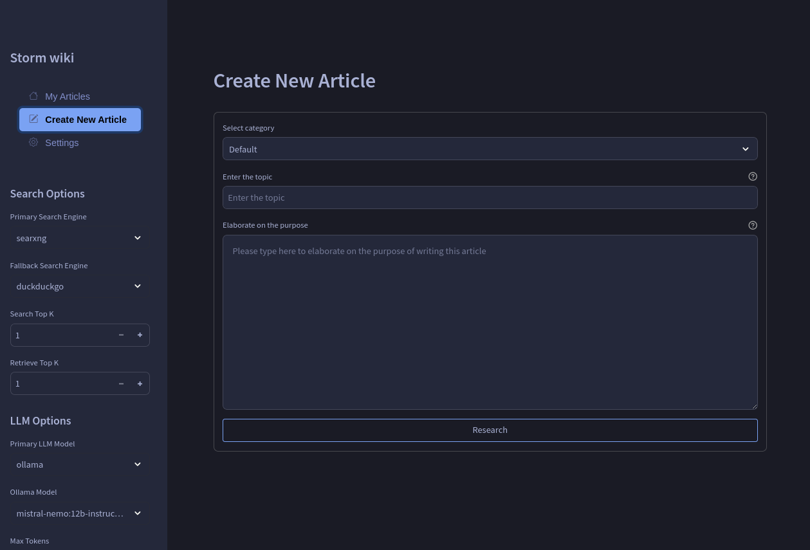

# STORM wiki

[STORM](https://github.com/stanford-oval/storm) frontend modified.

## Features & Changes

- dotenv for env vars
- save result files as '*.md'
- add date to to top of the result file
- added STORM_TIMEZONE
- configure dark and light theme colors
- configure arize-phoenix in settings
- configure searxng and other search engines in settings


<details><summary>screenshots</summary>

article


creating new article with search and llm fallback options



add categories


configure search engines


dark and light themes


</details>

## Prerequisites

- Python 3.10+
- `knowledge-storm` package or source code
- Required API keys (see main STORM repository)

## Installation

1. Clone the repository:
   ```sh
   git clone https://github.com/yourusername/storm-minimal-ui.git
   cd storm-minimal-ui
   ```

2. Install dependencies:
   ```sh
   pip install -r requirements.txt
   cp .env.example .env
   cp secrets.toml.example ./.streamlit/secrets.toml
   ```

   edit .env file
   ```
   STREAMLIT_OUTPUT_DIR=DEMO_WORKING_DIR
   OPENAI_API_KEY=YOUR_OPENAI_KEY
   STORM_TIMEZONE="America/Los_Angeles"
   ```

   also update serecets.toml

3. Set up API keys:
   - Copy `secrets.toml.example` to `.streamlit/secrets.toml`
   - Add your API keys to `.streamlit/secrets.toml`

## Usage

Run the Streamlit app:
```sh
streamlit run storm.py --server.port 8501 --server.address 0.0.0.0

```

## migrating existing articles with category
```sh
python -m util.migrate_articles
```

## Customization

Modify `set_storm_runner()` in `demo_util.py` to customize STORMWikiRunner settings. Refer to the [main STORM repository](https://github.com/stanford-oval/storm) for detailed customization options.

